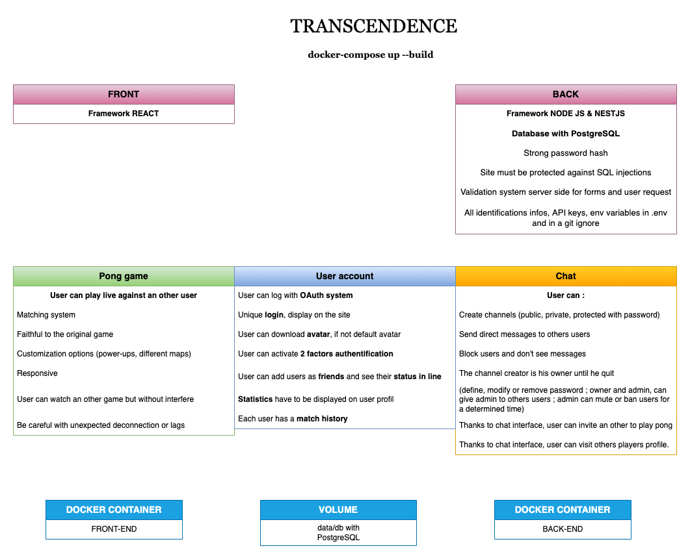

# Transcendence

Implement a website where users can play Pong with each other. 
There are a user interface, a chat and the games will be multiplayer online and in real time.

Some rules :

## Install frameworks

### Node JS

Node.js is not a programming language. 
Node.js is an open-source runtime environment for the JavaScript language that reshapes JavaScript’s characteristics and upgrades its functionality.

#### Installation guide on Debian 10 :

https://www.digitalocean.com/community/tutorials/how-to-install-node-js-on-debian-10

	sudo apt install curl
	su -
	curl -fsSL https://deb.nodesource.com/setup_19.x | bash - && apt-get install -y nodejs
	node -v
	npm -v

### Nest JS

#### Installation guide :

https://docs.nestjs.com/cli/overview

	npm install -g @nestjs/cli
	npm install -g npm@9.3.1

### React

React is a front-end JavaScript library developed by Facebook. Its aim is to allow developers to easily create fast user interfaces for websites and applications alike. The main concept of React js is virtual DOM. React is capable of making API calls (sending the request to the backend), which deal with the data. React cannot process the database or the data source itself.

#### Installation guide :

	npm install npm@latest -g
	npm create vite@latest
	Choose React and give a name to the project
	cd project-name
	npm install
	npm run dev
	Open port in VM

	npm update --save react 
	npm view react version

LEARN REACT
https://roadmap.sh/react/

Use Forms React Hook Form : https://reactjs.org/docs/hooks-custom.html

Use REST react-query : https://www.youtube.com/watch?v=novnyCaa7To

Use Styling Materia UI : https://mui.com/

Activate server :
https://www.digitalocean.com/community/tutorials/react-server-side-rendering-fr

## Docker

### POSTGRESSQL

PostgreSQL is an advanced, enterprise class open source relational database that supports both SQL (relational) and JSON (non-relational) querying.

POSTGRES IMAGE : https://hub.docker.com/_/postgres
POSTGRESQL CLI : https://www.geeksforgeeks.org/postgresql-create-database/?ref=lbp

Build and run container: 
	docker run --name postgres -e POSTGRES_PASSWORD=mypassword -d postgres

Exec container :
	docker exec -t <name> bash  		//get into container
	su postgres							//role root
	psql								//access to CLI
	\l	or \l+							//listing databases
	\c <name>							//connect db
	\dt									//listing tables

	CREATE DATABASE <name>; CREATE DATABASE
	CREATE TABLE <name> (column_name TYPE column constraint, table_constraint table_constraint) INHERITS 

### PGADMIN : front-end database

pgAdmin is a management tool for PostgreSQL and derivative relational databases.

PGADMIN IMAGE : https://hub.docker.com/r/dpage/pgadmin4

